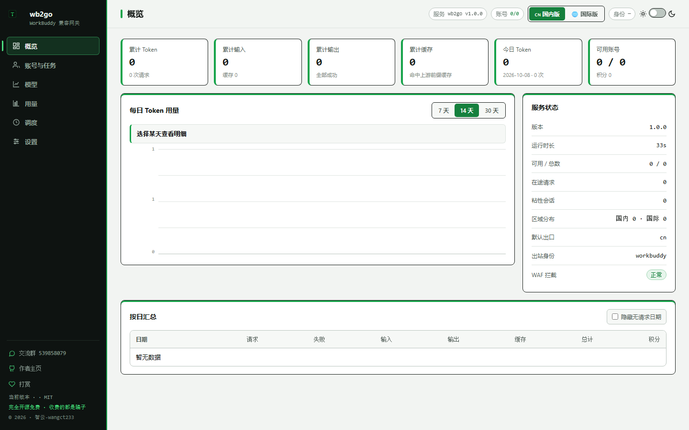
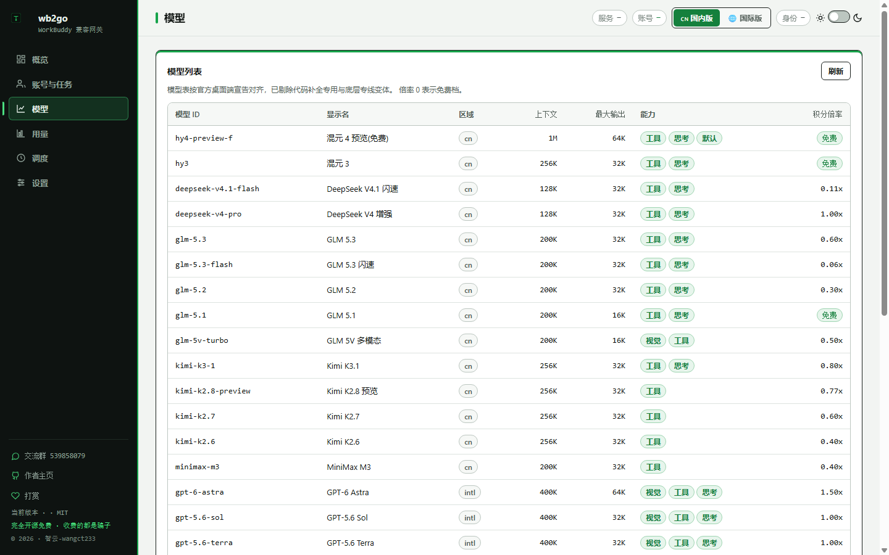

# wb2go

[](https://github.com/wangct233-source/wb2go/releases/latest)
[](LICENSE)
[](https://go.dev)
[](https://github.com/wangct233-source/wb2go/stargazers)
[](https://qm.qq.com/q/XcS6Sh8NYA)

**English** | 简体中文见下

> **wb2go** turns a WorkBuddy / CodeBuddy subscription into an **OpenAI-compatible API**.
> Multi-account pooling, China / Global dual-region routing, pure Go standard library
> (zero third-party deps), single-binary with embedded web console, hot updates.

把 WorkBuddy / CodeBuddy 订阅包装成 **OpenAI 兼容 API** 的多账号网关。
纯 Go 标准库实现，**零第三方依赖**，单文件二进制 + 内嵌 Web 控制台。

## 界面预览

| 概览 | 模型目录 |
|---|---|
|  |  |

双主题（亮 / 暗）· 国内版 / 国际版双区域 · 按日用量图表 · 全部内嵌进二进制，无任何外部资源。

```bash
# 方式一：直接拉预构建镜像（推荐，无需本机装 Go）
docker run -d --name wb2go --restart unless-stopped \
  -p 8788:8788 -e TZ=Asia/Shanghai \
  -v $(pwd)/accounts:/app/accounts \
  -v $(pwd)/data:/app/data \
  -v $(pwd)/config.json:/app/config.json \
  ghcr.io/wangct233-source/wb2go:latest

# 方式二：源码构建（需要 Go ≥ 1.23）
go build -o wb2go ./cmd/wb2go && ./wb2go
```

启动后打开 <http://127.0.0.1:8788/panel/> ，用浏览器完成 OAuth 授权即可。

---

## 📌 开源凭证与使用边界

本项目按 **MIT 协议**完全开源，代码可自由阅读、修改、再分发。

MIT 协议授予的是**代码层面**的自由：你可以拿去改、自己用、二次分发。
但它**不授予**你以本项目名义进行宣传、售卖、捆绑分发或索取作者背书的权利。

### 24 小时学习期免罚警告

> **在首次下载或使用本项目后的 24 小时内**，因学习、研究、评估、个人技术验证
> 而产生的行为（包括但不限于代码阅读、二次开发、本地自用），作者承诺**不予追究**、
> **不发出警告**。这段窗口的目的是让人能安心地先看清这个项目到底是什么，
> 再决定要不要继续使用。
>
> **24 小时之后**，是否继续使用完全由你自己判断并负责。本项目是自托管的个人工具，
> 作者不提供任何形式的担保、背书或技术支持，也不为使用者的行为承担任何责任。

### 明确反对的用法

以下行为与本项目无关，且作者明确反对：

- 批量注册账号、二次打包、加壳加密后对外分发；
- 搭建"公益中转""低价 API"等形式的对外服务并收费；
- 捆绑卡密 / 授权码售卖，或将本项目与收费服务绑定。

**请勿购买任何"收费版""卡密版"。** 本项目永远免费开源。任何加壳、加密、
捆绑收费的"版本"都是第三方篡改产物 —— 你付钱买的不是这个项目，
而是把自己账号凭证交给陌生人的机会（`accounts/` 里保存的是**明文 accessToken**）。

### 免责

本项目是**非官方**工具，与 WorkBuddy / CodeBuddy 及其母公司无任何关联，
未获任何背书。使用上游账号涉及目标平台的服务条款，账号是否被限制、
接口是否变更、是否产生费用，均由使用者自行承担。作者不对任何直接或间接损失负责。

---

## 功能

| 能力 | 说明 |
|---|---|
| **OpenAI 兼容** | `/v1/chat/completions`（流式 + 非流式）、`/v1/models` |
| **Responses API** | `/v1/responses`，Codex / Claude Code 可直连 |
| **多账号池** | 最早到期优先 + 加权随机 + Top-5 短名单 + 防惊群 |
| **四维冷却** | 账号级 / 熔断 / 连败降权 / 模型级，四者并列互不干扰 |
| **会话粘性** | 多级会话键 + 内容前缀兜底，TTL 滚动续期，失败自动解绑 |
| **出站身份** | 官方桌面端 / VSCode 插件 / 命令行三套，账号级可单独指定 |
| **设备指纹** | 由 UID 稳定派生，同号恒定、异号隔离 |
| **指纹脱敏** | 清洗客户端注入的框架指纹串（可选，默认开） |
| **定时任务** | 签到 / 旅行 / 成长任务 / 活跃上报 / Token 保活 / 余额刷新 |
| **Web 控制台** | 内嵌单页，双主题，账号运维、用量图表、调度状态、在线改配置 |
| **配置热生效** | 面板保存即刻生效，无需重启 |
| **热更新** | 拉取 GitHub Release 预编译产物，校验后原子替换并重启 |
| **Docker 预构建** | 多架构镜像，`docker run` 一条命令完成安装 |

## 设计取舍

### 零第三方依赖

只用 Go 标准库。代价是有些轮子要自己造（目录展示宽度、手写模板等），
收益是**部署无供应链风险**，且用户可以逐行审计全部代码。

### 超时分三段

| 字段 | 作用对象 | 默认 | 理由 |
|---|---|---|---|
| `header_timeout` | 聊天首字节前 | 120s | 等不到响应头 = 换号重发 |
| `chat_timeout` | 聊天流中空闲 | 300s | 活跃吐字续命，静默才掐流 |
| `rpc_timeout` | 短 RPC 总时长 | 120s | 到期报错走熔断 |

**聊天流刻意不设总时长上限**：长思考 / 长输出不该被总时长误杀。
若沿用很多 HTTP 客户端默认的 300s 总超时，活跃的 SSE 流也会被判定超时。

### 确定性错误不轮转

内容审核、请求体畸形、图片非法 —— 这三类换任何账号都会撞同一堵墙。
轮转只会白消耗其他账号的额度并污染它们的失败计数，因此直接返回。

### 模型级冷却独立于账号级

上游 `code 6004` 表示"**该模型**用量超限"，不是账号整体被限流。
按账号级冷却处理，会让"换个模型就能用"的号被整体摘出池子。

### 粘性的两个理由

1. **保住缓存**：上游 prompt cache 是账号级的，换号等于换一份服务端上下文缓存；
2. **拟人**：真实用户的一次会话属于同一账号，逐轮跳号是易识别的批量特征。

## 配置

`config.example.json` 是完整参考。首次启动会自动生成 `config.json`
（未设 `api_key` 时自动生成随机密钥并落盘）。

常用项：

| 字段 | 默认 | 说明 |
|---|---|---|
| `listen` | `:8788` | 监听地址 |
| `api_key` | 空 | 留空 = 不鉴权（**公网必须设置**） |
| `auth_dir` | `./accounts` | 账号凭证目录 |
| `identity` | `workbuddy` | 出站身份：`workbuddy` / `vscode` / `cli` |
| `default_realm` | `cn` | 默认出口：`cn` / `intl` |
| `max_in_flight` | `3` | 单账号在途上限（0 = 不限） |
| `credit_floor` | `0` | 积分保底：余额低于此值的号不接收费模型 |
| `reserve_credits` | `0` | 保留积分：低于此值停止接单 |
| `daily_token_limit` | `0` | 每日 Token 上限，超出自动停用至次日 |
| `sanitize` | `true` | 指纹脱敏开关 |
| `update.github_release` | 空 | 填 `owner/repo` 后面板可一键热更新 |

所有时长字段用字符串（`"600s"` / `"15m"` / `"2h"`），
非法值**启动即报错**，不静默回落默认值。

## 定时任务

| 任务 | 默认时点 | 说明 |
|---|---|---|
| 签到 | 09:00 / 21:00 | 国内版账号领积分 |
| 猫猫旅行 | 09:00 / 21:00 | 自动派出与领奖 |
| 成长任务 | 10:00 / 16:00 | 接取 → 上报 → 自动领奖 |
| 活跃上报 | 10:00 | 点亮连续登录 |
| Token 保活 | 22:00 | 定时刷新凭证 |
| 余额刷新 | 每 5 分钟 | 余额恢复后自动解冻冷却账号 |

调度器每分钟检查一次触发点（而非长睡到下一个整点）：
系统休眠会冻结长定时器，分段判断的实现是幂等的，错过就等下一次。

## 客户端接入

```bash
export OPENAI_BASE_URL="http://127.0.0.1:8788/v1"
export OPENAI_API_KEY="面板里配置的 api_key"
```

Codex / Claude Code 直接可用（Responses API 已实现）。

## 安全须知

- `accounts/` 里的凭证是**明文 token**，权限 `0600`，务必不要提交到 git；
- 服务**只提供明文 HTTP**，公网部署务必前置 HTTPS 反代；
- `api_key` 为空时任何人都能调用你的网关，**不要这样暴露到公网**；
- 面板与 API 共用同一套密钥，面板页面的 CSP 已收紧到 `default-src 'none'`。

## 二进制部署（推荐生产）

```bash
# 下载（国内可加加速前缀 https://ghfast.top/<原链接>）
sudo mkdir -p /opt/wb2go && cd /opt/wb2go
sudo wget https://github.com/wangct233-source/wb2go/releases/latest/download/wb2go-linux-amd64
sudo chmod +x wb2go-linux-amd64
./wb2go-linux-amd64   # 首次启动自动生成 config.json 与随机 API Key（看启动日志）
```

生产环境强烈建议配 systemd 守护（崩溃自动拉起 + 开机自启）：

```ini
# /etc/systemd/system/wb2go.service
[Unit]
Description=wb2go gateway
After=network-online.target
Wants=network-online.target

[Service]
WorkingDirectory=/opt/wb2go
ExecStart=/opt/wb2go/wb2go -config /opt/wb2go/config.json
Restart=always
RestartSec=5
# 以非 root 运行；属主记得 chown -R wb2go:wb2go /opt/wb2go
User=wb2go
NoNewPrivileges=true
ProtectSystem=strict
ReadWritePaths=/opt/wb2go

[Install]
WantedBy=multi-user.target
```

```bash
sudo systemctl daemon-reload && sudo systemctl enable --now wb2go
sudo systemctl status wb2go     # active (running) 即正常
journalctl -u wb2go -f          # 看日志
```

升级 = 下载新二进制覆盖 + `systemctl restart wb2go`；或在配置里开启热更新后面板一键升级。

## 从源码构建

```bash
go build ./...
go vet ./...
go test ./...

# 交叉编译各平台产物（热更新用的就是这些）
CGO_ENABLED=0 GOOS=linux   GOARCH=amd64 go build -trimpath -ldflags="-s -w -X main.Version=1.0.0" -o dist/wb2go-linux-amd64   ./cmd/wb2go
CGO_ENABLED=0 GOOS=linux   GOARCH=arm64 go build -trimpath -ldflags="-s -w -X main.Version=1.0.0" -o dist/wb2go-linux-arm64   ./cmd/wb2go
CGO_ENABLED=0 GOOS=windows GOARCH=amd64 go build -trimpath -ldflags="-s -w -X main.Version=1.0.0" -o dist/wb2go-windows-amd64 ./cmd/wb2go
CGO_ENABLED=0 GOOS=darwin  GOARCH=arm64 go build -trimpath -ldflags="-s -w -X main.Version=1.0.0" -o dist/wb2go-darwin-arm64  ./cmd/wb2go
```

## 热更新原理

1. 查 GitHub Releases 最新 tag，按平台筛选产物；
2. 只接受 `github.com` / `*.githubusercontent.com` 的 HTTPS 链接；
3. 下载到临时文件并计算 SHA-256；
4. 备份当前二进制 → 原子替换 → 失败自动回滚；
5. 用 `/proc/self/exe` 重新 exec 新进程（容器视角里进程不中断，restart 策略不误触发）。

面板「设置 → 热更新」可一键执行，也支持定期自动检查。

## 目录结构

```
cmd/wb2go/           入口：装配所有组件
internal/
  config/            配置加载、校验、热生效（Config=数据 / Runtime=保护）
  store/             凭证持久化（原子写 + 路径穿越白名单）
  account/           账号池状态机、选号、粘性路由、状态持久化
  upstream/          上游协议层：身份、指纹、脱敏、改写管线、SSE、错误分类、短 RPC
  proxy/             HTTP 边界：协议转换、轮转、聚合
  tasks/             整点调度器
  usage/             用量记账与按日聚合
  panel/             面板 API + OAuth
  web/               go:embed 前端（双主题单页）
  hotupdate/         GitHub Release 热更新
```

## License

MIT，见 [LICENSE](LICENSE)。协议允许自由使用、修改、分发，
但**不授予**以本项目名义宣传、售卖或索取背书的权利。
